# RAI Inspection Agent 技术特点说明

本文档说明 `rai_inspection_agent` 将大模型推理、知识检索、记忆系统、视觉分析、ROS 2 工具和安全边界组合起来，形成一个可交互、可扩展、可审计的巡检助手。

## 总体定位

`rai_inspection_agent` 是一个业务层 agent 项目，负责把“巡检机器人应该做什么”表达清楚，并把巡检相关工具组织起来。RAI 则提供更通用的底座能力，例如模型初始化、LangGraph agent、记忆系统、RAG、ROS 2 通信和工具运行框架。

两者的关系可以理解为：

- RAI 提供通用框架：模型、记忆、工具执行、ROS 2 连接、RAG 检索。
- `rai_inspection_agent` 提供巡检业务：巡检提示词、视觉检测要求、云台拍照、气体监测、扬声器报警、多点导航策略等。

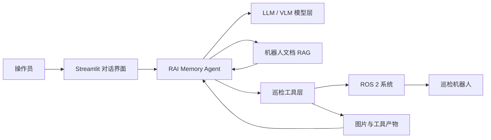

### Agent 能扮演的角色

`rai_inspection_agent` 不是单一角色系统，而是一个面向巡检任务的复合助手。  

（1） **长任务分解和规划者**

当用户说“按顺序前往 point1 到 point8 并检查环境”时，agent 需要把自然语言目标拆成多个步骤：查找或理解点位、逐个导航、等待到达、拍照、分析、汇报结果。

这种能力来自 LLM 的推理和工具调用循环。它适合处理“目标明确但步骤较多”的任务，但仍需要工具结果约束，不能让模型凭空认为任务完成。

（2） **视觉检测能力提供者**

系统可以通过云台拍照获取现场图片，并交给视觉模型进行分析。视觉分析不是裸看图，而是先检索视觉检测要求，再按要求判断图片中的异常。

这让视觉分析更接近“按巡检标准检查”，而不是普通图片描述。

（3） **知识库助手**

agent 可以回答机器人手册相关问题，例如尺寸、运动能力、传感器参数、topic 名称、运行限制等; 并且针对特定应用场景可以建立知识库，回答操作要求、分析要求。回答时依赖 RAG，而不是依赖模型记忆。

（4） **语义地图**

agent 将语义地图、空间信息存储在长期记忆层，并支持多机共享。agent 可以接收自然语言描述乃至语音输入，完成语义导航，作为整个规划任务的基础模块之一。

- TODO: 语音输入仅预留了接口，未实现

（5） **操作员协作界面**

Streamlit 前端提供对话入口和工具调用可视化。操作员可以看到 agent 的回答，也可以在侧边栏查看工具调用结果，方便排查任务过程。

## 1. RAI 底座与业务应用分层

需要先区分两层：RAI 是通用机器人智能体框架，`rai_inspection_agent` 是基于 RAI 的巡检业务应用。

RAI 负责沉淀通用能力：

- 模型接入与配置管理。
- LangGraph agent 执行循环。
- 短期和长期记忆。
- 工具调用保护。
- 多模态消息和工具产物管理。
- ROS 2 通信封装。
- RAG 文档检索。
- Streamlit 前端复用组件。

`rai_inspection_agent` 负责定义巡检业务：

- 巡检机器人的角色设定和行为规则。
- 巡检专用工具，例如云台拍照、图片分析、气体监测、报警控制。
- 机器人手册和视觉检测要求。
- 针对巡检任务的工具权限覆盖，例如多点导航允许连续调用。

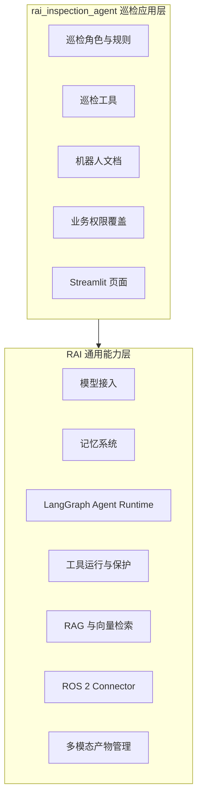

这种分层的优点是：通用能力可以在多个机器人项目中复用，巡检相关变化则保留在应用层，避免把业务逻辑污染到通用框架。

## 2. 模型层分离设计

系统把模型能力和业务逻辑分开。巡检 agent 不直接依赖某一个固定模型，而是通过配置选择模型供应商、服务地址和模型名称。

这种设计的价值在于：业务逻辑稳定，模型可以按部署条件替换。例如同一套巡检逻辑可以连接云端模型，也可以连接本地 OpenAI-compatible 服务。

当前配置支持的方向包括：

- OpenAI-compatible 接口：可对接 vLLM、llama.cpp server、Xinference、LM Studio 等兼容 `/v1/chat/completions` 或 `/v1/embeddings` 的服务。
- Ollama：适合本地快速部署和边缘端调试。
- AWS Bedrock：适合云端托管模型。
- Google Gemini：适合通用多模态能力接入。

在巡检场景里，模型层通常拆成三类：

| 类型 | 作用 | 典型使用位置 |
| --- | --- | --- |
| 对话模型 | 理解用户意图、规划步骤、调用工具 | 主 agent |
| 视觉模型 | 分析图片、判断异常 | 图片分析工具 |
| 嵌入模型 | 把文档和问题转为向量 | RAG 检索 |

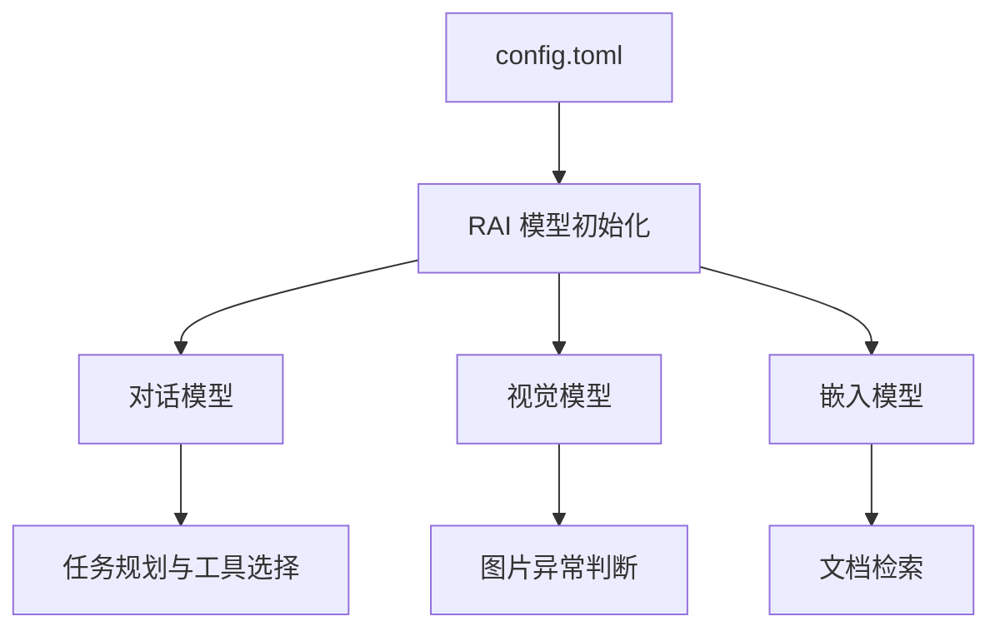

这种分离让系统可以独立优化不同环节：对话模型负责“会不会规划”，视觉模型负责“看得准不准”，嵌入模型负责“文档找得准不准”。

当前模型层支持不同的模型加速推理框架，以下典型技术路径均完成过验证:  
（1）VLLM
专为大规模服务器端并发高吞吐量设计的推理引擎，核心是利用 PagedAttention 技术极大压榨显存利用率。

（2）LLAMA.CPP
专为消费级硬件和边缘端打造的纯 C/C++ 推理框架，核心是让没有高端显卡的普通电脑、Mac 甚至嵌入式设备也能通过 CPU 和量化流畅运行大模型。

（3）OLLAMA
专为开箱即用和本地开发者打造的打包工具（底层基于 llama.cpp），核心是像 Docker 一样，通过一行命令就能完成大模型的下载、运行和标准 API 部署。

具体说明:  
（1）当前默认模型推理框架是 LLAMA.CPP，并本地成功验证 mtp 技术:
**MTP（多 Token 预测）**是一种通过在模型架构中引入多个并行预测头，改变传统逐字（Single-Token）输出模式，实现单次前向传播同时预测未来多个连续 Token 的大规模语言模型高效训练与推理技术。

（2）当前使用的模型（经过筛选、参数优化和测试）:
- 大语言模型: unsloth/Qwen3.6-27B-MTP-GGUF:Q4_K_M
- 视觉模型: unsloth/Qwen3.6-27B-MTP-GGUF:Q4_K_M
- 嵌入模型: Qwen/Qwen3-Embedding-0.6B-GGUF

## 3. Agent 执行机制

RAI 使用 LangGraph 组织 agent 的执行流程。它不是一次性调用模型得到答案，而是采用“模型思考 -> 工具执行 -> 再思考”的循环。

典型过程如下：

1. 根据当前对话、系统提示词、长期记忆和用户输入构造上下文。
2. 调用对话模型判断是否需要工具。
3. 如果需要工具，则执行工具并把结果写回对话。
4. 模型读取工具结果，继续调用工具或生成最终回答。

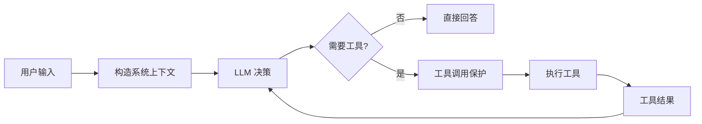

这个设计让 agent 具备长任务分解能力。例如“前往多个点位并检查现场”不会被硬编码为一个固定脚本，而是由模型根据目标选择导航、等待、拍照、分析等工具组合完成。

同时，RAI 并不把所有上下文都无节制塞给模型。对话过长时，系统会保留近期消息，并把更早内容压缩成短期摘要，减少上下文膨胀。

## 4. 短期记忆如何实现

短期记忆用于保存当前会话线程中的消息历史。它解决的问题是：用户和 agent 多轮交互时，系统需要知道前面说过什么、调用过哪些工具、工具返回了什么结果。

RAI 的短期记忆基于 LangGraph checkpointer 实现。可以理解为：每个对话线程都会有一份可恢复的运行状态，里面包含消息列表、系统提示词和摘要信息。

当前支持的后端包括：

- SQLite：适合本地开发、单机部署和边缘设备。
- Postgres：适合服务化部署和多实例场景。

短期记忆的特点：

- 线程级：不同会话可以隔离保存。
- 可恢复：页面刷新或重新进入时，可以恢复之前的对话状态。
- 支持多模态消息：图片类消息和工具产物可以进入可序列化状态。
- 支持摘要压缩：对话变长后，早期上下文会被总结，近期消息继续保留原文。

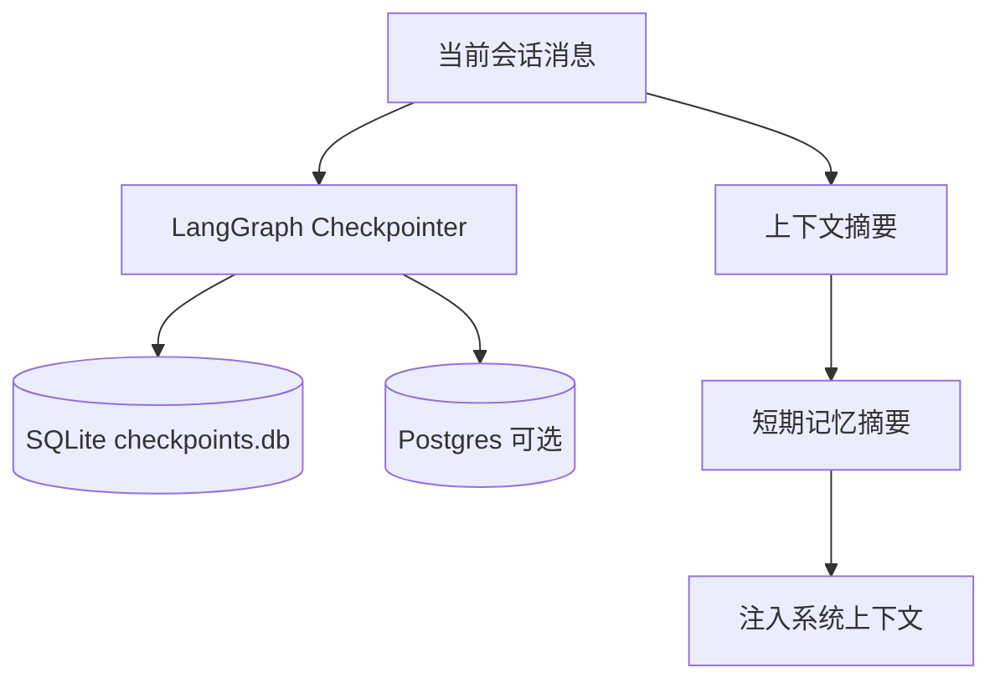

短期记忆不等于长期知识库。它主要服务当前对话连续性，不负责保存机器人手册，也不适合承载稳定业务知识。

## 5. 长期记忆如何实现

长期记忆用于保存跨会话仍然有价值的信息，例如用户偏好、重要事实、常用地点和位置数据。

RAI 的长期记忆基于 LangGraph store 实现。它可以像键值存储一样保存结构化信息，也可以结合嵌入模型做语义检索。当前支持 SQLite 和 Postgres 两种后端。

长期记忆包含几类典型操作：

- `save_fact`：保存文字事实，例如“操作员偏好先拍照再分析”。
- `save_location`：保存空间位置，例如某个巡检点的坐标和朝向。
- `forget_memory`：删除不再需要或用户要求忘记的信息。

长期记忆会按 namespace 和 user_id 隔离。这意味着同一套系统可以区分不同用户或不同任务域，避免记忆互相污染。

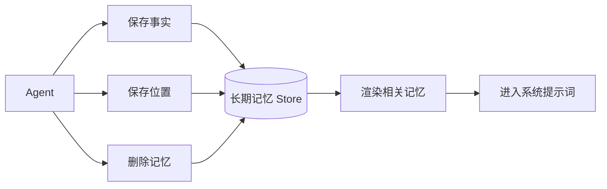

长期记忆和 RAG 的边界很重要：

| 能力 | 保存内容 | 更新方式 | 典型用途 |
| --- | --- | --- | --- |
| 长期记忆 | 交互中学习到的事实、偏好、位置 | agent 通过记忆工具写入 | 个性化、点位复用、跨会话连续性 |
| RAG 文档库 | 机器人手册、传感器参数、检测要求 | 文档更新后重建索引 | 准确回答静态知识、提供检测依据 |

这两个系统互补，而不是互相替代。长期记忆让 agent 记住“用户和任务历史”，RAG 让 agent 查到“机器人和业务资料”。

## 6. RAG 检索增强

巡检机器人需要知道自己的硬件参数、传感器说明、ROS 2 接口、运行限制和视觉检测要求。这些知识不适合全部写进提示词，也不适合依赖模型记忆。RAI 使用 RAG 将机器人文档变成可检索知识库，让 agent 在需要时查阅准确资料。

### 如何实现

RAG 的流程分为离线构建和在线检索两部分。

离线阶段：

1. 从 `data/rosbotxl_whoami` 读取机器人文档。
2. 对 Markdown、文本、URDF 等文档进行加载。
3. 按标题结构和文本长度切分成文档片段。
4. 使用嵌入模型生成向量。
5. 保存到 FAISS 向量索引。

在线阶段：

1. agent 或工具提出查询，例如“视觉检测要求”。
2. 查询被转换为向量。
3. 在 FAISS 中查找最相关文档片段。
4. 检索结果作为上下文交给 agent 或视觉分析工具。

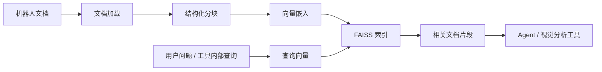

### 优越性

RAG 的核心优势不是“让模型更聪明”，而是让模型在回答时能依赖当前项目的真实资料。

- 减少幻觉：回答基于检索到的手册和配置，而不是模型猜测。
- 知识可更新：修改文档并重建索引即可更新知识，不需要重新训练模型。
- 可解释：结果能追溯到文档片段，适合巡检、应急、工业等严肃场景。
- 降低提示词负担：系统不需要把整本手册塞进 prompt。
- 支持工具内部使用：不是只有聊天时能查文档，工具也可以在执行前检索要求。

### 和 agent 如何配合

RAG 在当前系统里有两种配合方式：

- agent 主动调用 `query_robot_docs`，回答硬件参数、传感器、ROS 2 topic、运行限制等问题。
- 工具内部强制检索，例如视觉分析工具在分析图片前先查询“视觉检测要求”，再把要求和图片一起交给视觉模型。

第二种方式比单纯依赖提示词更可靠。因为“视觉分析前必须读取检测标准”属于业务流程约束，不应该完全交给模型自由决定。

## 7. 多模态消息与工具产物管理

巡检任务天然包含图片。RAI 提供多模态消息和工具产物机制，使图片不会简单混在普通文本里，而是作为可管理的 artifact 保存和传递。

在 `rai_inspection_agent` 中，云台拍照工具会返回图片产物；视觉分析工具可以读取这些产物，并把图片交给视觉模型分析。这样做有几个好处：

- 对话历史不会被大段图片数据污染。
- 图片和工具调用 ID 关联，便于追踪来源。
- 视觉分析可以默认使用最近一次拍照结果，也可以指定某次工具调用。
- 前端可以展示工具调用和产物信息，方便调试。

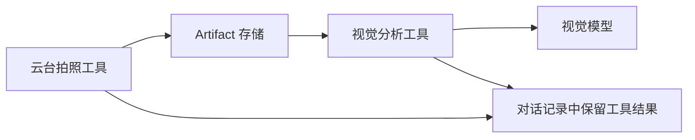

这也是 RAI 的一个重要设计思想：agent 读到的是经过工具整理后的结果，而不是直接面对底层文件系统和传感器数据。

## 8. Agent 安全边界设计

机器人 agent 不能只追求“能执行”，还要控制“不要乱执行”。当前系统通过多层边界降低不安全行为。

### 工具边界

agent 不能直接执行任意 Python 或 shell 命令，只能调用注册过的工具。每个工具只暴露有限参数，例如导航目标、云台拍照参数、气体监测操作、扬声器报警命令等。

这种方式把模型限制在“可控动作集合”中：模型可以选择工具，但不能越过工具直接操作机器人底层。

### 提示词边界

系统提示词明确区分不同工具的用途。例如：

- 机器人静态资料使用 RAG 工具。
- 拍照使用云台拍照工具。
- 分析图片使用视觉分析工具。
- 气体泄漏和温度异常对应不同扬声器报警命令。
- 没有目标检测能力时要说明限制，而不是编造检测结果。

### 调用次数边界

RAI 工具执行层包含调用保护机制，避免 agent 在同一轮对话中无限重复调用工具。`rai_inspection_agent` 对导航工具做了业务侧覆盖，使多点巡航任务可以连续导航，同时仍保留总调用上限。

### 结果边界

工具返回失败时，agent 被要求报告失败原因，而不是假装成功。例如导航失败、图片不存在、传感器读取失败时，工具会返回结构化状态或错误信息，agent 应基于这些结果回应用户。

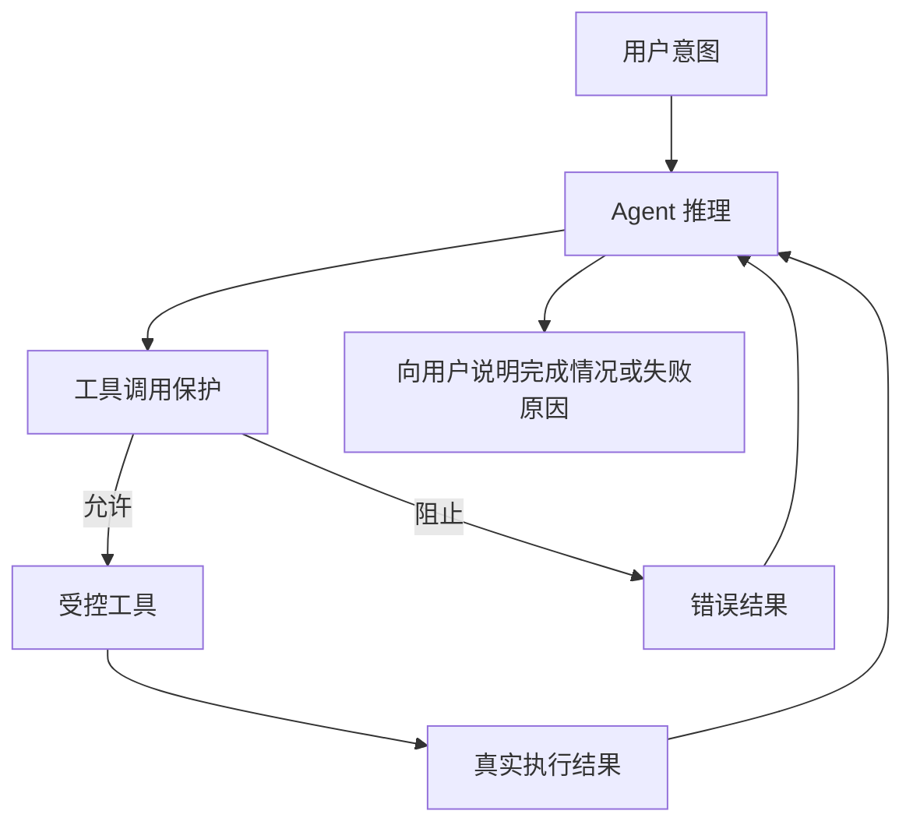

## 9. 工具层设计与特点

工具层是连接“语言模型”和“机器人动作”的关键。它把每个机器人能力包装成一个明确、有限、可测试的接口。

当前工具大致分为五类：

| 工具类别 | 作用 |
| --- | --- |
| 位姿与导航 | 获取当前位置、执行目标点导航、等待 |
| 云台与拍照 | 回中云台、拍摄巡检图片、保存图片产物 |
| 图片分析 | 读取工具产物中的图片，结合检测要求进行视觉分析 |
| 气体监测 | 启动监测、读取状态、停止监测 |
| 声光/语音告警 | 播放气体泄漏或温度异常报警，停止播放 |

工具层的特点：

- 明确输入输出：每个工具有固定参数和返回结构。
- 业务语义清晰：工具名直接表达巡检动作，而不是底层技术细节。
- 可组合：agent 可以把导航、拍照、分析、报警组合成完整巡检流程。
- 可审计：工具调用结果会进入对话历史和侧边栏展示。
- 可测试：工具可以用 mock connector 或 fake model 单独测试。

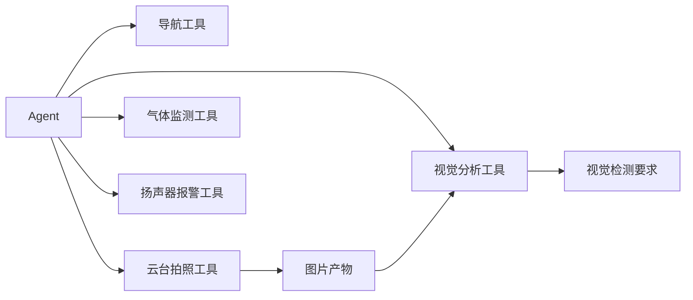

## 10. 与 ROS 2 的配合设计

RAI 通过 ROS 2 connector 把工具调用转换为 ROS 2 action、service、topic 或 TF 查询。agent 不直接操作 ROS 2 API，而是通过工具间接访问机器人能力。

这种设计有两个好处：

- 对 agent 友好：模型只需要理解“导航到目标点”“读取气体状态”，不需要理解 ROS 2 消息细节。
- 对机器人安全：ROS 2 交互被限制在预定义工具中，参数和超时都可以在工具层控制。

典型映射如下：

| Agent 动作 | ROS 2 交互形式 |
| --- | --- |
| 获取当前位置 | TF / pose 查询 |
| 导航到目标点 | Nav2 action |
| 云台回中并拍照 | 自定义 action |
| 控制扬声器报警 | service 调用 |
| 读取气体状态 | topic 读取 |

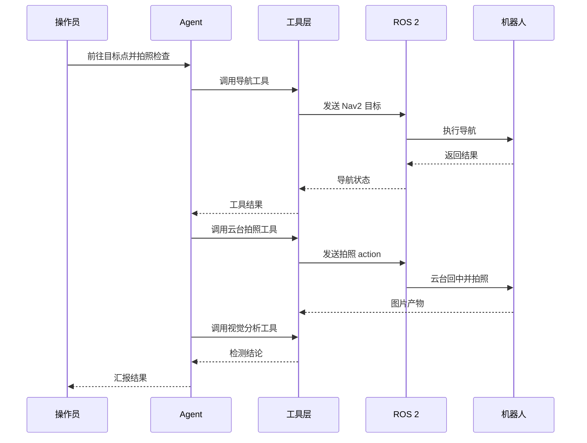

## 11. 前端和可观测性

RAI 提供 Streamlit 前端组件，`rai_inspection_agent` 在此基础上构建巡检页面。前端不仅显示聊天消息，还会展示工具调用结果、记忆侧边栏和配置状态。

这种设计适合研发和现场调试：

- 操作员可以像聊天一样下达任务。
- 工程人员可以查看工具调用是否正确。
- 失败时可以看到工具返回的原始错误信息。
- 记忆、namespace、机器人文档路径等配置可以在侧边栏暴露。

RAI 还预留了 tracing 配置，例如 LangSmith、Langfuse 等，用于记录模型调用和链路执行。对于复杂 agent，链路追踪非常重要，因为问题往往不只出现在模型，也可能出现在检索、工具参数、ROS 2 通信或消息压缩环节。

## 12. 巡检工作流示例

下面是一次典型“拍照并判断异常”的流程：

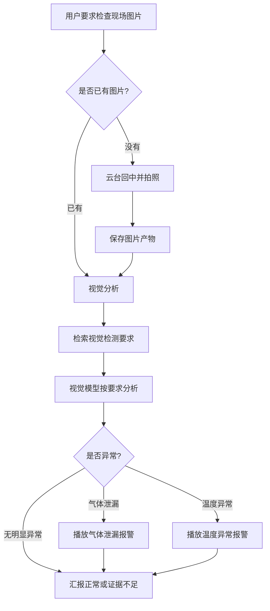

这个流程体现了当前系统的设计原则：模型负责理解和组织任务，工具负责真实执行，RAG 提供标准依据，ROS 2 负责连接机器人。

## 13. 技术优势总结

`rai_inspection_agent -> RAI` 的组合有以下特点：

- 模型可替换：业务逻辑不绑定单一模型，可按算力和部署方式选择后端。
- 记忆可分层：短期记忆保持当前任务上下文，长期记忆保存跨会话事实和位置。
- 知识可检索：机器人文档通过 RAG 提供给 agent 和工具。
- 动作可控：agent 只能调用注册工具，不能任意执行系统动作。
- 流程可组合：导航、拍照、分析、报警可以组合成长任务。
- 结果可审计：工具调用和图片产物可以追踪。
- ROS 2 友好：把复杂 ROS 2 接口包装成自然语言 agent 可理解的工具。
- 业务可扩展：新的巡检能力优先放在 `rai_inspection_agent`，通用能力沉淀到 RAI。

## 15. 适用边界

当前系统适合“人机协作式巡检”，即操作员给出任务，agent 规划并调用工具执行。它不应被理解为完全无人监管的安全控制系统。

需要注意的边界包括：

- 视觉模型结论应作为巡检辅助判断，关键安全动作仍应保留人工确认或独立安全链路。
- RAG 依赖文档质量，文档过期会影响回答准确性。
- 工具执行结果必须被认真处理，不能让 agent 忽略失败状态。
- 导航、报警等动作应继续保留权限和次数限制，避免失控循环。

总体而言，该架构的目标不是让大模型直接“控制机器人”，而是让大模型在清晰边界内调度一组可验证工具，帮助操作员更高效地完成巡检任务。
