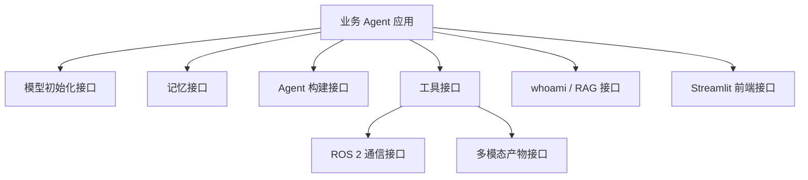
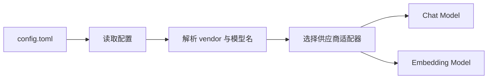
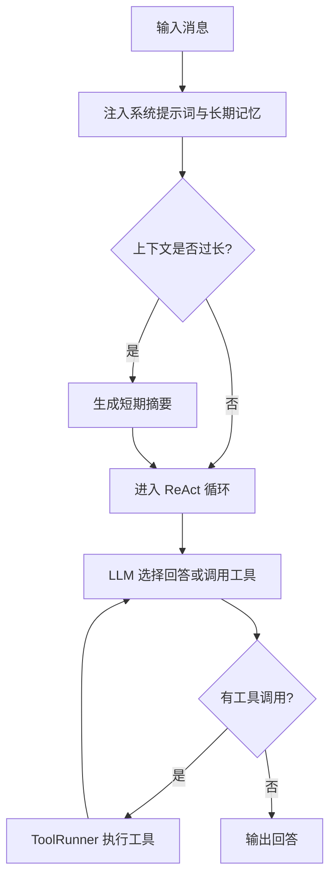
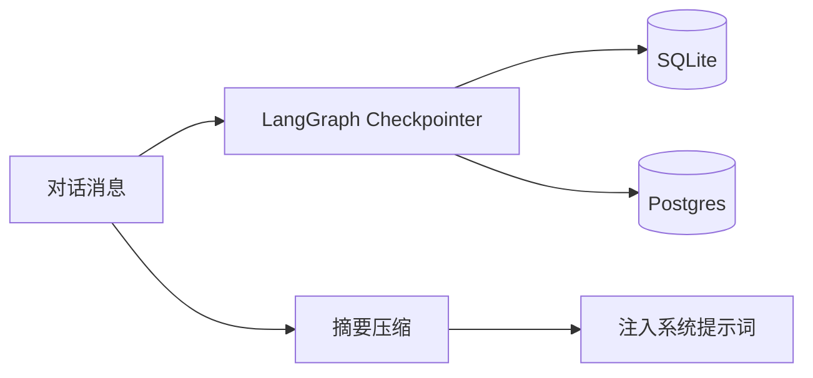
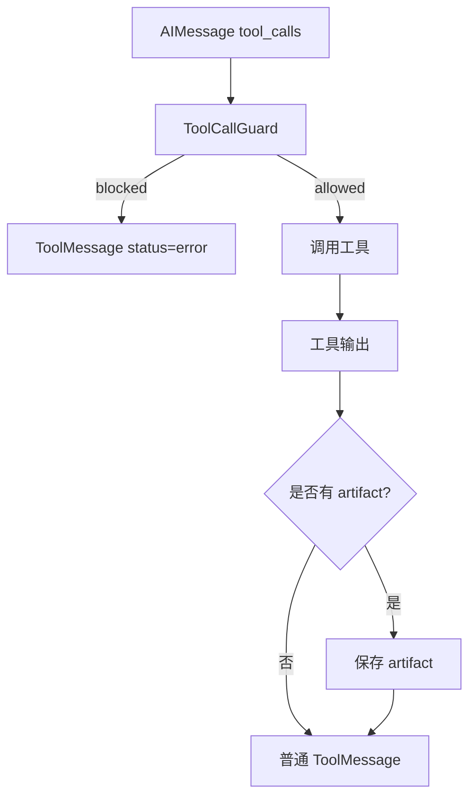
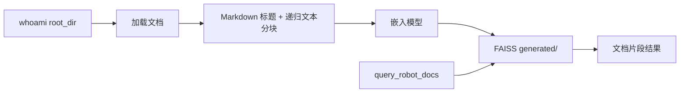

# RAI 功能接口文档

本文档梳理 RAI 作为机器人智能体底座提供的主要功能接口。它面向基于 RAI 开发业务 agent 的工程人员，重点说明“可以使用哪些能力、如何接入、输入输出是什么、边界在哪里”。

RAI 的定位不是某个具体机器人应用，而是通用能力层：模型接入、Agent 执行、记忆、工具运行、ROS 2 通信、RAG 文档检索、多模态消息和前端组件。

## 1. 总体接口分层



| 层级 | 主要模块 | 作用 |
| --- | --- | --- |
| 模型层 | `rai.initialization` | 从 `config.toml` 初始化 LLM、VLM、Embedding 和 tracing |
| Agent 层 | `rai.memory`, `rai.agents.langchain` | 构建 ReAct / Memory Agent，组织模型和工具循环 |
| 记忆层 | `rai.memory`, `rai.tools.memory` | 管理短期会话状态和长期跨会话记忆 |
| 工具层 | `rai.tools` | 将可执行能力包装成 LangChain Tool |
| ROS 2 层 | `rai.communication.ros2`, `rai.tools.ros2` | 封装 topic、service、action、TF 等 ROS 2 能力 |
| RAG 层 | `rai_whoami` | 加载机器人文档，构建 FAISS 索引，提供文档查询工具 |
| 多模态层 | `rai.messages` | 管理图片、音频等工具产物和多模态消息 |
| 前端层 | `rai.frontend` | 提供 Streamlit 聊天、记忆侧栏、工具结果展示组件 |

## 2. 模型初始化接口

RAI 通过 `config.toml` 管理模型供应商和模型名称。业务应用通常不直接实例化 LangChain 模型，而是调用 RAI 的初始化接口。

### 2.1 主要接口

| 接口 | 输入 | 输出 | 用途 |
| --- | --- | --- | --- |
| `get_llm_model(model_type, vendor=None, config_path=None, **kwargs)` | `simple_model` 或 `complex_model` | LangChain chat model | 初始化对话模型 |
| `get_embeddings_model(config_path=None, return_kwargs=False)` | 可选配置路径 | LangChain embeddings | 初始化向量嵌入模型 |
| `get_llm_model_direct(model_name, vendor, config_path=None, **kwargs)` | 显式模型名和供应商 | LangChain chat model | 绕过 `simple/complex` 预设直接初始化 |
| `get_llm_model_config_and_vendor(model_type, vendor=None, config_path=None)` | 模型类型 | 模型配置和供应商名 | 查看模型解析结果 |
| `get_tracing_callbacks(config_path=None)` | 可选配置路径 | callback 列表 | 接入 LangSmith / Langfuse 追踪 |

### 2.2 配置接口

核心配置位于 `config.toml`。

```toml
[vendor]
simple_model = "openai.vlm"
complex_model = "openai.vlm"
embeddings_model = "openai.embeddings"

[openai.vlm]
base_url = "http://host:port/v1"
api_key = "EMPTY"
model = "model-name"

[openai.embeddings]
base_url = "http://host:port/v1"
api_key = "EMPTY"
model = "embedding-model"
```

支持的模型后端包括：

- OpenAI-compatible 服务：适合 vLLM、llama.cpp server、Xinference 等。
- Ollama：适合本地模型快速接入。
- AWS Bedrock：适合托管模型。
- Google Gemini：适合 Google 多模态模型。

### 2.3 调用流程



### 2.4 边界说明

- RAI 只负责实例化模型对象，不保证远端模型服务可用。
- OpenAI-compatible 服务需要遵循基本 API 兼容约定。
- Embedding 模型用于 RAG 和长期记忆语义检索时，索引构建和查询必须使用兼容的向量维度。

## 3. Agent 构建接口

RAI 提供基于 LangGraph 的 agent 运行框架。它采用“LLM 决策 -> 工具执行 -> LLM 读取结果”的循环。

### 3.1 Memory Agent 接口

| 接口 | 输入 | 输出 | 用途 |
| --- | --- | --- | --- |
| `create_memory_agent_with_tools(...)` | MemoryManager、LLM、系统提示词构造器、工具列表、namespace、user_id | LangGraph Runnable | 构建带短期/长期记忆的 agent |
| `create_memory_react_agent(...)` | MemoryManager、LLM、工具、系统提示词构造器 | LangGraph Runnable | 构建记忆感知 ReAct graph |
| `build_memory_system_prompt(...)` | 基础提示词、长期记忆、额外章节 | system prompt 文本 | 合成最终系统提示词 |

典型输入：

- `memory_mgr`：已启动的 MemoryManager。
- `llm`：由 `get_llm_model()` 创建的对话模型。
- `base_tools`：业务工具列表。
- `extra_tools`：例如 RAG 文档查询工具。
- `extra_prompt_sections`：额外系统提示词片段。

### 3.2 执行流程



### 3.3 状态接口

Memory Agent 的状态包含：

| 字段 | 含义 |
| --- | --- |
| `messages` | 当前线程消息历史，包括用户消息、AI 消息、工具消息、多模态消息 |
| `summary` | 历史对话摘要 |
| `system_prompt` | 当前轮构造出的系统提示词 |

运行上下文包含：

| 字段 | 含义 |
| --- | --- |
| `user_id` | 用户标识，用于长期记忆隔离 |
| `namespace` | 任务域或应用命名空间 |
| `transient_images` | 临时图片输入，用于多模态对话 |

## 4. 记忆接口

RAI 将记忆分成短期记忆和长期记忆。

### 4.1 MemoryManager

| 接口 | 作用 |
| --- | --- |
| `MemoryManager(config=None, config_path=None, embeddings=None)` | 创建记忆管理器 |
| `start()` | 初始化 checkpointer 和 store |
| `setup()` | 执行后端表结构或索引初始化 |
| `stop()` | 关闭资源 |
| `checkpointer` | 短期记忆后端 |
| `store` | 长期记忆后端 |

### 4.2 Memory 配置

```toml
[memory]
enabled = true
backend = "sqlite"
short_term_path = "data/checkpoints.db"
long_term_path = "data/store.db"
connection = ""
namespace = "default"
```

| 字段 | 含义 |
| --- | --- |
| `enabled` | 是否启用记忆 |
| `backend` | `sqlite` 或 `postgres` |
| `short_term_path` | SQLite 短期记忆数据库路径 |
| `long_term_path` | SQLite 长期记忆数据库路径 |
| `connection` | Postgres 连接字符串 |
| `namespace` | 记忆命名空间 |

### 4.3 短期记忆

短期记忆由 LangGraph checkpointer 提供，用于保存线程内对话状态。

特点：

- 保存当前对话消息和工具结果。
- 支持页面刷新后的会话恢复。
- 支持多模态消息序列化。
- 上下文过长时可生成摘要，保留近期消息。



### 4.4 长期记忆

长期记忆由 LangGraph store 提供，用于跨会话保存事实和空间信息。

| 工具 | 输入 | 输出 | 用途 |
| --- | --- | --- | --- |
| `save_fact` | `fact: str` | 保存确认消息 | 保存事实、偏好、规则 |
| `save_location` | `location_name`, `pose`, `objects`, `description` | 保存确认消息 | 保存空间点位和环境信息 |
| `recall_memory` | `query`, `memory_type`, `limit` | 匹配记忆列表 | 搜索长期记忆 |
| `forget_memory` | `query` | 删除结果 | 删除匹配记忆 |

默认 Memory Agent 会向 agent 暴露 `save_fact`、`save_location` 和 `forget_memory`，长期记忆内容会在每轮系统提示词中渲染给模型。

## 5. 工具运行接口

RAI 工具层基于 LangChain `BaseTool`。工具是 agent 能执行外部动作的唯一受控入口。

### 5.1 ToolRunner

`ToolRunner` 负责：

- 接收 AIMessage 中的 tool calls。
- 按工具名查找注册工具。
- 做调用策略检查。
- 执行工具并生成 ToolMessage。
- 保存多模态 artifact。



### 5.2 ToolCallGuard

调用保护策略包括：

| 策略 | 作用 |
| --- | --- |
| `max_total_calls_per_turn` | 限制单轮总工具调用数量 |
| `max_calls_per_turn` | 限制某个工具单轮调用次数 |
| `max_consecutive_calls` | 限制连续重复调用同一工具 |
| `block_similar_args` | 阻止相似参数重复调用 |

默认策略会对记忆工具、RAG 工具等做保护。业务应用也可以在应用层覆盖策略，但应保留总调用上限，避免失控循环。

### 5.3 通用工具

| 工具 | 输入 | 输出 | 用途 |
| --- | --- | --- | --- |
| `WaitForSecondsTool` | `seconds` | 等待完成文本 | 暂停执行，最大等待 10 秒 |
| memory tools | 见长期记忆 | 文本结果 | 长期记忆 CRUD |

## 6. ROS 2 通信接口

ROS 2 是机器人能力接入的关键。RAI 提供连接器和工具两层接口。

### 6.1 ROS2Connector

主要能力包括：

| 能力 | 说明 |
| --- | --- |
| `send_message` | 发布 topic 消息 |
| `receive_message` | 订阅并接收 topic 消息 |
| `service_call` | 调用 ROS 2 service |
| `create_service` | 创建 service server |
| `start_action` | 发送 action goal |
| `terminate_action` | 终止 action |
| `get_transform` | 查询 TF transform |
| `get_services_names_and_types` | 获取 service 列表 |
| `get_actions_names_and_types` | 获取 action 列表 |

接口使用 `ROS2Message` 作为通用消息包装，内部再转换为 ROS 2 原生消息。

### 6.2 BaseROS2Tool

业务工具通常继承 `BaseROS2Tool`。它提供三个权限字段：

| 字段 | 含义 |
| --- | --- |
| `readable` | 允许读取的 topic/resource 白名单 |
| `writable` | 允许写入的 topic/service/action 白名单 |
| `forbidden` | 禁止访问的资源列表 |

工具执行前可以调用 `is_readable()` 和 `is_writable()` 判断资源权限。

### 6.3 常用 ROS 2 工具

| 工具 | 输入 | 输出 | 用途 |
| --- | --- | --- | --- |
| `get_ros2_robot_position` | 预配置 source/target frame | transform 文本 | 获取机器人位姿 |
| `get_current_pose` | 无 | x/y/z/yaw 文本 | 获取当前导航位姿 |
| `navigate_to_pose_blocking` | `x`, `y`, `z`, `yaw` | 成功/失败文本 | 阻塞式导航到目标点 |
| `get_ros2_camera_image` | 预配置 topic | 图片 artifact | 获取相机图像 |

## 7. RAG / whoami 接口

`rai_whoami` 是 RAI 的机器人文档和 embodiment 知识模块。

### 7.1 配置接口

```toml
[whoami]
enabled = true
root_dir = "data/rosbotxl_whoami"
build_vector_db = true
k = 4

[whoami.retrieval]
strategy = "vector"
vector_k = 8
keyword_k = 8
final_k = 4
normalize_embeddings = true
distance_strategy = "inner_product"
```

| 字段 | 含义 |
| --- | --- |
| `enabled` | 是否启用机器人文档工具 |
| `root_dir` | 文档根目录 |
| `build_vector_db` | 启动时是否构建 FAISS 索引 |
| `strategy` | `vector`、`keyword` 或 `hybrid` |
| `vector_k` | 向量召回数量 |
| `keyword_k` | 关键词召回数量 |
| `final_k` | 最终返回数量 |
| `normalize_embeddings` | 是否归一化向量 |
| `distance_strategy` | FAISS 距离策略 |

### 7.2 文档加载接口

`EmbodimentSource.from_directory(root_dir)` 读取以下目录：

| 子目录 | 内容 |
| --- | --- |
| `documentation/` | PDF、Word、Markdown、文本等文档 |
| `images/` | 机器人图片 |
| `urdfs/` | URDF / xacro |

文档加载器映射：

| 扩展名 | Loader |
| --- | --- |
| `.pdf` | `PyPDFLoader` |
| `.doc`, `.docx` | `Docx2txtLoader` |
| `.txt`, `.md`, `.urdf`, `.xacro` | `TextLoader` |

### 7.3 检索工具

| 工具 | 输入 | 输出 | 用途 |
| --- | --- | --- | --- |
| `query_robot_docs` | `query: str` | 格式化文档片段 | 查询机器人静态文档 |
| `query_database` | `query: str` | 格式化文档片段 | 通用向量库查询工具 |

`create_robot_docs_tool(config, embeddings_model=None)` 会根据配置确保向量库存在，并返回 `query_robot_docs` 工具。

### 7.4 RAG 流程



## 8. 多模态消息与 artifact 接口

RAI 用多模态消息封装文本、图片和音频，并用 artifact 存储工具产物。

| 接口 | 作用 |
| --- | --- |
| `HumanMultimodalMessage` | 用户多模态输入 |
| `AIMultimodalMessage` | AI 多模态输出 |
| `ToolMultimodalMessage` | 工具多模态输出 |
| `store_artifacts(tool_call_id, artifacts, db_path=...)` | 保存工具产物 |
| `get_stored_artifacts(tool_call_id, db_path=...)` | 读取工具产物 |
| `preprocess_image(...)` | 图片转模型可用表示 |

artifact 常见字段：

| 字段 | 含义 |
| --- | --- |
| `images` | 已可展示或引用的图片 |
| `raw_images` | base64 图片数据 |
| `audios` | 音频数据 |
| `summary` | 产物摘要 |

## 9. 前端接口

RAI 提供 Streamlit 组件，业务应用可以复用：

| 组件 | 用途 |
| --- | --- |
| `render_memory_sidebar` | 渲染记忆侧边栏和用户切换 |
| `render_memory_chat_input` | 渲染输入框并调用 graph |
| `render_chat_messages_with_tools` | 展示消息和工具调用 |
| multimodal frontend helpers | 展示图片、音频等多模态内容 |

典型使用方式是：业务应用负责页面标题、配置展示和工具初始化，RAI 前端组件负责对话状态和 graph 调用。

## 10. 接口使用边界

- RAI 提供通用能力，不应包含具体业务规则。
- 业务工具应通过 `BaseTool` 或 `BaseROS2Tool` 暴露有限、可审计的动作。
- 模型输出不能绕过工具权限直接操作机器人。
- 长期记忆存储用户交互产生的信息，不应替代机器人手册 RAG。
- RAG 文档更新后需要重建索引，避免索引与文档不一致。
- ROS 2 接口要求已安装并 source ROS 2 环境。

