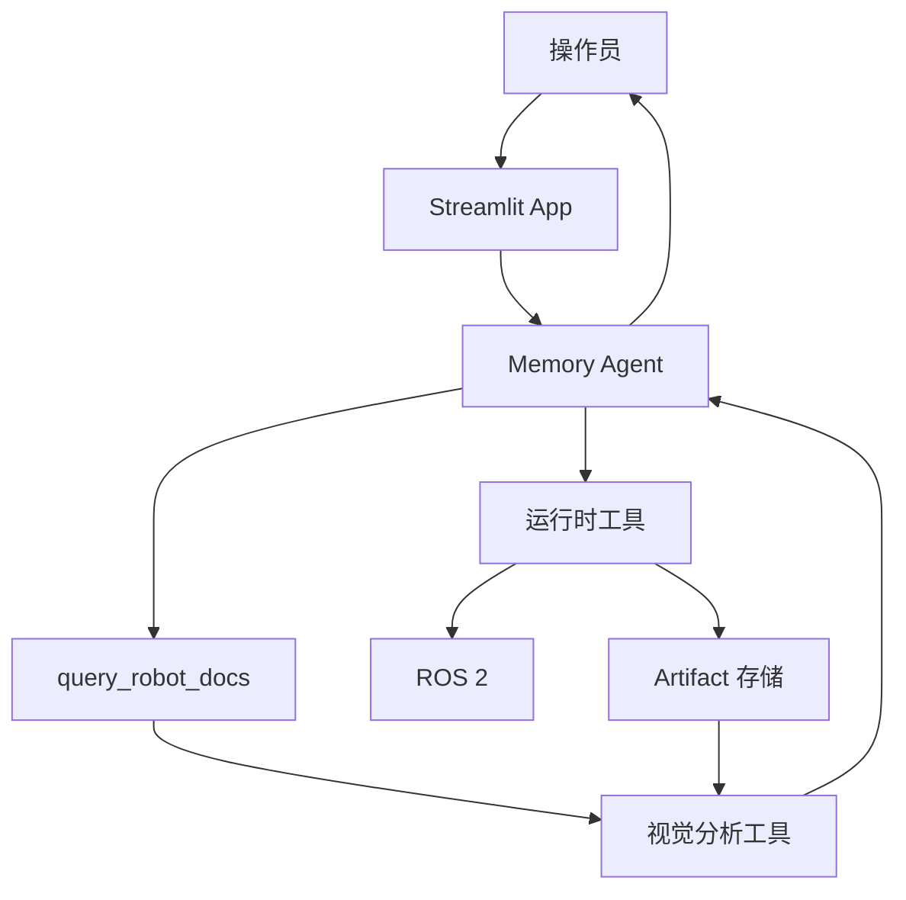
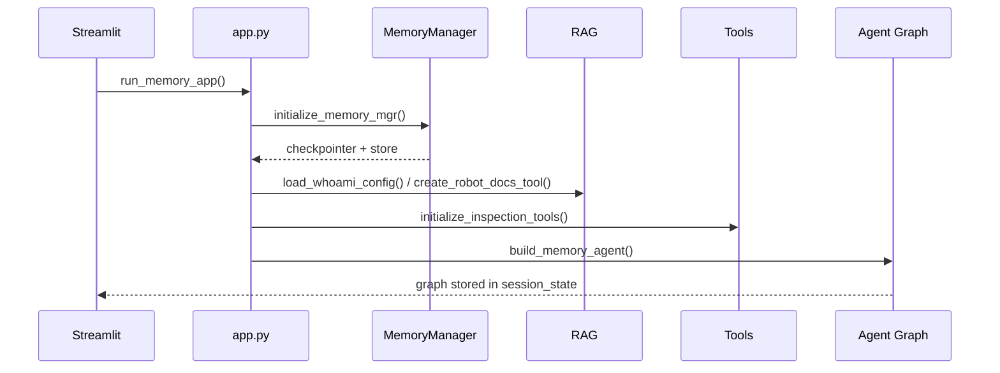
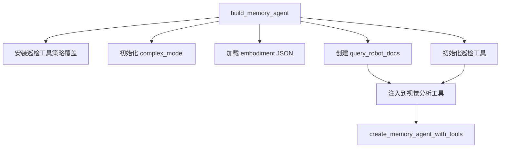
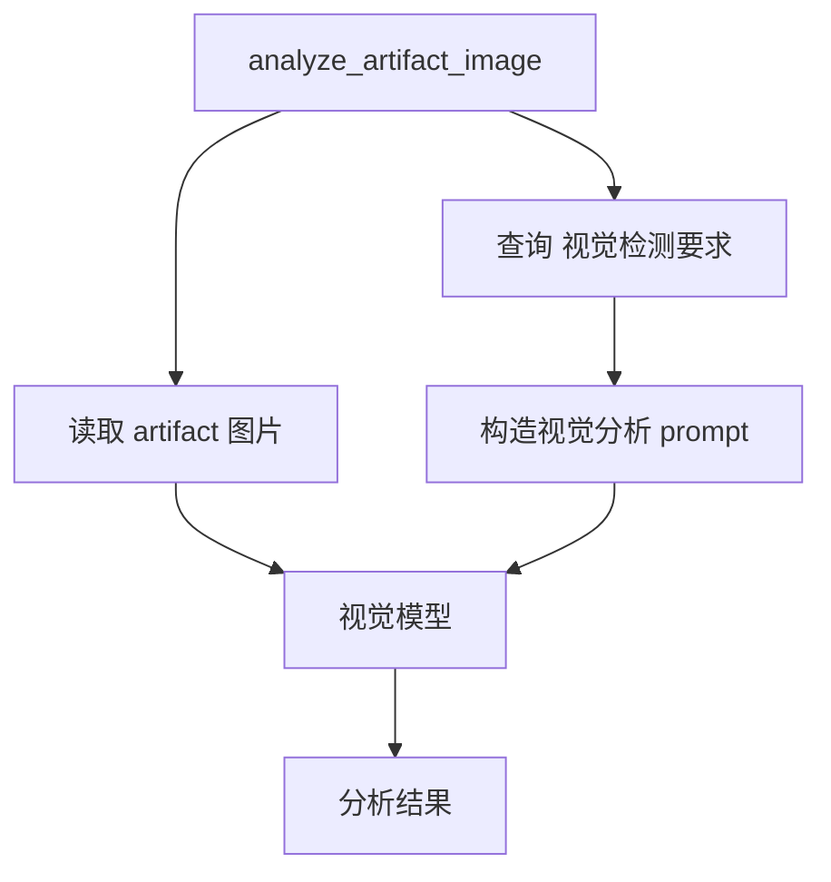
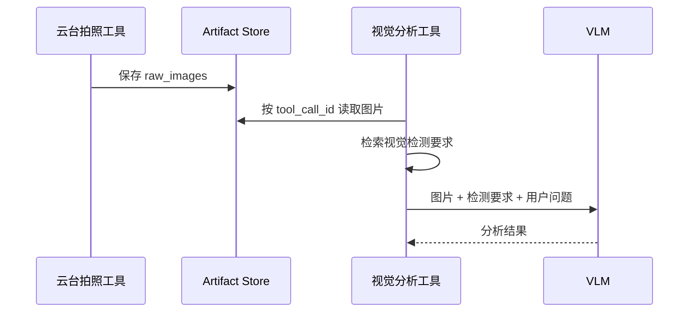

# RAI Inspection Agent 功能接口文档

本文档梳理 `rai_inspection_agent` 的应用层接口。它说明该巡检 agent 如何使用 RAI 底座能力，并向操作员、模型、工具和 ROS 2 系统暴露哪些功能。

`rai_inspection_agent` 的定位是：面向巡检机器人的业务 agent。它不替代 RAI，而是在 RAI 提供的模型、记忆、工具、RAG、ROS 2 和前端接口之上，组装巡检场景需要的能力。

## 1. 应用总体接口



应用接口分为：

| 接口类型 | 面向对象 | 说明 |
| --- | --- | --- |
| 运行入口 | 操作员 / 运维 | 启动 Streamlit agent |
| 配置接口 | 工程人员 | 配置模型、记忆、RAG、ROS 2 行为 |
| Agent 构建接口 | 应用代码 | 创建带巡检工具和记忆的 agent graph |
| 工具接口 | LLM agent | agent 可调用的巡检动作 |
| ROS 2 接口 | 机器人系统 | topic、service、action、TF |
| 文档检索接口 | agent / 视觉工具 | 查询机器人手册和检测要求 |
| Artifact 接口 | 工具之间 | 传递拍照结果和图片分析输入 |

## 2. 运行入口

### 2.1 启动命令

```bash
cd ~/rai_inspection_agent
source /opt/ros/jazzy/setup.bash
uv run streamlit run rai_inspection_agent/app.py
```

如果运行环境使用 zsh，建议通过 bash 执行 ROS 2 setup 脚本，避免 shell 兼容问题。

### 2.2 页面入口

| 页面能力 | 说明 |
| --- | --- |
| 聊天输入 | 操作员输入自然语言任务 |
| 消息展示 | 展示用户、AI、工具消息 |
| 记忆侧栏 | 管理 user_id、查看历史记忆 |
| 工具调用侧栏 | 展示每次工具调用结果 |
| 配置信息 | 展示 memory backend、namespace、robot docs 路径 |

### 2.3 初始化流程



## 3. 配置接口

配置文件为项目根目录下的 `config.toml`。

### 3.1 模型配置

| 配置段 | 作用 |
| --- | --- |
| `[vendor]` | 选择 simple、complex、embedding 使用的供应商 |
| `[openai]` | 默认 OpenAI-compatible 模型服务 |
| `[openai.vlm]` | 视觉/复杂任务模型服务 |
| `[openai.embeddings]` | embedding 模型服务 |
| `[ollama]` | Ollama 本地模型配置 |
| `[aws]` | AWS Bedrock 配置 |
| `[google]` | Google Gemini 配置 |

当前应用使用：

- `complex_model`：主 agent 和视觉分析默认模型。
- `embeddings_model`：长期记忆语义索引和 RAG 检索。

### 3.2 记忆配置

```toml
[memory]
enabled = true
backend = "sqlite"
short_term_path = "data/checkpoints.db"
long_term_path = "data/store.db"
namespace = "default"
```

| 字段 | 说明 |
| --- | --- |
| `enabled` | 必须为 true，否则应用会停止 |
| `backend` | 当前通常使用 sqlite |
| `short_term_path` | 当前对话 checkpoint |
| `long_term_path` | 长期记忆 store |
| `namespace` | 记忆命名空间 |

### 3.3 RAG 配置

```toml
[whoami]
enabled = true
root_dir = "data/rosbotxl_whoami"
build_vector_db = true

[whoami.retrieval]
strategy = "vector"
vector_k = 8
keyword_k = 8
final_k = 4
normalize_embeddings = true
distance_strategy = "inner_product"
```

| 字段 | 说明 |
| --- | --- |
| `enabled` | 是否启用机器人文档工具 |
| `root_dir` | 文档和向量库根目录 |
| `build_vector_db` | 是否启动时重建向量库 |
| `strategy` | 检索策略：vector / keyword / hybrid |
| `final_k` | 返回给 agent 的最终文档片段数量 |

## 4. Agent 构建接口

应用层主要通过 `build_memory_agent(...)` 构建 agent。

| 参数 | 类型/含义 | 默认 |
| --- | --- | --- |
| `memory_mgr` | RAI MemoryManager | 必填 |
| `embodiment_path` | 机器人角色 JSON 路径 | 必填 |
| `user_id` | 用户标识 | `default` |
| `namespace` | 记忆命名空间 | `inspection` |
| `robot_docs_config` | whoami 配置 | 从 `config.toml` 加载 |
| `embeddings_model` | embedding 模型 | 自动从 RAI 初始化 |
| `robot_tools` | 运行时工具列表 | 自动初始化 |

构建过程：



### 4.1 Agent 系统提示词接口

系统提示词由三部分组成：

| 片段 | 作用 |
| --- | --- |
| Embodiment | 机器人身份、能力、规则 |
| Robot Runtime Tools | 导航、位姿、等待等运行时工具说明 |
| Inspection Runtime Tools | 拍照、图片分析、气体、报警等巡检工具说明 |
| Robot Documentation Retrieval | 指导何时使用 RAG 文档查询 |

### 4.2 工具权限覆盖

应用层对 RAI 默认工具调用保护做了巡检场景覆盖：

| 项 | 值 |
| --- | --- |
| 单轮总工具调用上限 | 20 |
| `navigate_to_pose_blocking` 单轮上限 | 12 |
| `navigate_to_pose_blocking` 连续调用上限 | 12 |

目的：支持“按顺序前往多个点位”这类长任务，同时仍保留总调用保护。

## 5. 巡检工具接口

### 5.1 工具总览

| 工具名 | 来源 | 作用 |
| --- | --- | --- |
| `get_ros2_robot_position` | RAI | 查询 map 到 base_link 的 TF |
| `WaitForSecondsTool` | RAI | 等待指定秒数 |
| `navigate_to_pose_blocking` | RAI | 阻塞式 Nav2 导航 |
| `get_current_pose` | RAI | 获取当前导航位姿 |
| `center_gimbal_and_capture` | 应用 | 云台回中并拍照 |
| `analyze_artifact_image` | 应用 | 分析图片 artifact |
| `control_speaker_alarm` | 应用 | 控制扬声器报警 |
| `start_gas_monitoring` | 应用 | 启动气体监测 |
| `read_gas_status` | 应用 | 读取气体状态 |
| `stop_gas_monitoring` | 应用 | 停止气体监测 |
| `query_robot_docs` | RAI whoami | 查询机器人文档 |
| `save_fact` / `save_location` / `forget_memory` | RAI memory | 长期记忆写入和删除 |

## 6. 云台拍照工具接口

工具名：`center_gimbal_and_capture`

### 6.1 输入参数

| 参数 | 类型 | 默认 | 说明 |
| --- | --- | --- | --- |
| `task_id` | int | `0` | 巡检任务编号 |
| `camera_type` | str | `visible` | 相机通道，如 visible、ir、thermal、depth |
| `photo_count` | int | `1` | 拍照数量 |
| `photo_interval_seconds` | float | `0.0` | 多张照片间隔 |
| `zoom_level` | float | `0.0` | 光学变焦，0 表示保持当前 |
| `home_timeout_sec` | float | `15.0` | 云台回中超时 |
| `capture_timeout_sec` | float | `15.0` | 拍照超时 |

### 6.2 ROS 2 接口

| 项 | 值 |
| --- | --- |
| action | `/center_gimbal_and_capture` |
| action type | `inspection_interfaces/action/CenterGimbalAndCapture` |
| 结果超时 | 默认 60 秒 |

### 6.3 输出

成功时返回文本内容和图片 artifact：

| 输出项 | 说明 |
| --- | --- |
| `status` | succeeded / failed |
| `action_id` | action 句柄 |
| `image_uri` | 图片路径 |
| `captured_count` | 实际拍照数量 |
| `elapsed_sec` | 执行耗时 |
| artifact `raw_images` | 供视觉模型使用的图片数据 |

## 7. 图片分析工具接口

工具名：`analyze_artifact_image`

### 7.1 输入参数

| 参数 | 类型 | 默认 | 说明 |
| --- | --- | --- | --- |
| `tool_call_id` | str | `latest` | 要分析的工具 artifact ID |
| `question` | str | 默认检查问题 | 图片分析问题 |
| `max_images` | int | `1` | 最多发送给视觉模型的图片数量 |

### 7.2 内部 RAG 前置流程

图片分析工具会在调用视觉模型前，先使用 `query_robot_docs` 检索“视觉检测要求”。这不是依赖 agent 自觉规划，而是工具内部强制执行。



### 7.3 输出

| 字段 | 说明 |
| --- | --- |
| `tool_call_id` | 被分析的 artifact 来源 |
| `analyzed_images` | 实际分析图片数量 |
| `analysis` | 视觉模型输出 |

### 7.4 边界

- 如果没有 artifact，返回“无可分析图片”。
- 如果指定 tool_call_id 无图片，返回对应错误说明。
- 如果 RAG 检索失败，工具仍会继续分析，但 prompt 中会带有检索失败说明。

## 8. 气体监测工具接口

### 8.1 `start_gas_monitoring`

| 项 | 值 |
| --- | --- |
| service | `/monitor/gas/start` |
| service type | `std_srvs/srv/Trigger` |
| 输入 | 无 |
| 输出 | `status`, `service_name`, `response`, `error_message` |

### 8.2 `read_gas_status`

| 项 | 值 |
| --- | --- |
| topic | `/monitor/gas/status` |
| topic type | `diagnostic_msgs/msg/DiagnosticStatus` |
| 输入 | `timeout_sec`，默认 2 秒 |
| 输出 | `level`, `name`, `message`, `hardware_id`, `values`, `error_message` |

`values` 会整理为气体传感器摘要，包括传感器 ID、气体类型、浓度、单位、报警阈值和状态。

### 8.3 `stop_gas_monitoring`

| 项 | 值 |
| --- | --- |
| service | `/monitor/gas/stop` |
| service type | `std_srvs/srv/Trigger` |
| 输入 | 无 |
| 输出 | `status`, `service_name`, `response`, `error_message` |

## 9. 扬声器报警工具接口

工具名：`control_speaker_alarm`

### 9.1 输入参数

| command | 作用 |
| --- | --- |
| `gas_leak` | 播放气体泄漏报警 |
| `temperature_abnormal` | 播放温度异常报警 |
| `stop` | 停止播放 |

### 9.2 ROS 2 接口

| 项 | 值 |
| --- | --- |
| service | `/alarm_aggregator_node/set_parameters` |
| service type | `rcl_interfaces/srv/SetParameters` |

工具会把业务命令转换为 ROS 2 参数设置：

- `gas_leak` -> `alarm_category = gas`, `play = true`
- `temperature_abnormal` -> `alarm_category = camera`, `play = true`
- `stop` -> `play = false`

## 10. 位姿与导航接口

### 10.1 `get_ros2_robot_position`

| 项 | 值 |
| --- | --- |
| source frame | `map` |
| target frame | `base_link` |
| 输出 | transform / position 信息 |

### 10.2 `get_current_pose`

| 项 | 值 |
| --- | --- |
| frame_id | `map` |
| robot_frame_id | `base_link` |
| 输出 | `x`, `y`, `z`, `yaw` 文本 |

### 10.3 `navigate_to_pose_blocking`

| 参数 | 类型 | 说明 |
| --- | --- | --- |
| `x` | float | map 坐标 x |
| `y` | float | map 坐标 y |
| `z` | float | map 坐标 z |
| `yaw` | float | 目标朝向，弧度 |

| 项 | 值 |
| --- | --- |
| action | `navigate_to_pose` |
| frame | `map` |
| 成功输出 | `Navigate to pose successful.` |
| 失败输出 | 包含 Nav2 状态和错误信息 |

## 11. 文档检索接口

工具名：`query_robot_docs`

| 输入 | 输出 | 用途 |
| --- | --- | --- |
| `query: str` | 多个文档片段，含 source、page、content | 查询机器人静态文档 |

适用问题：

- 机器人尺寸、重量、运动性能。
- 传感器配置。
- ROS 2 topic / frame / action 说明。
- 运行限制与安全规则。
- 视觉检测要求。

不适用：

- 用户偏好。
- 当前任务记忆。
- 实时传感器状态。
- 当前位姿。

## 12. Artifact 数据接口

巡检 agent 使用 artifact 在工具之间传递图片。



artifact 常见字段：

| 字段 | 说明 |
| --- | --- |
| `raw_images` | base64 图片，供 VLM 使用 |
| `images` | 可引用图片列表 |
| `summary` | 产物摘要 |
| `audios` | 音频产物 |

默认 artifact 根目录为 `data/artifacts`。

## 13. 前端状态接口

Streamlit 使用 `st.session_state` 保存应用状态。

| key | 说明 |
| --- | --- |
| `memory_mgr` | RAI MemoryManager |
| `graph` | 当前用户的 agent graph |
| `_last_user` | 上一次构建 graph 的 user_id |
| `user_id` | 当前用户 |

当 user_id 切换时，应用会重新构建 graph，使长期记忆按用户隔离。

## 14. 测试接口与可替换点

应用设计支持测试替换：

| 可替换点 | 用途 |
| --- | --- |
| `robot_tools` 参数 | 用 fake tools 替换真实 ROS 2 工具 |
| `embeddings_model` 参数 | 用测试 embedding 替代远端服务 |
| `llm` 字段 | 视觉分析工具可注入 fake VLM |
| `robot_docs_tool` 字段 | 视觉分析工具可注入 fake RAG |
| ROS2 connector | 工具测试可使用 mock connector |

这使得大部分业务逻辑可以在没有真实机器人和模型服务的情况下测试。

## 15. 主要错误与返回语义

| 场景 | 返回方式 |
| --- | --- |
| 没有 artifact 图片 | `No artifact images are available to analyze.` |
| 指定 artifact 无图片 | `No artifact images found for tool_call_id=...` |
| 导航失败 | `Navigate to pose action failed...` |
| 气体服务调用失败 | 返回 dict，`status=failed`，含 `error_message` |
| 扬声器服务调用失败 | 返回 dict，`status=failed`，含 `error_message` |
| 工具调用被 policy 阻止 | ToolMessage `status=error`，内容为 `Tool call blocked...` |

业务约束：agent 应将这些失败结果如实报告给用户，不应把失败当成成功。

## 16. 接口边界和使用建议

- `rai_inspection_agent` 不直接暴露任意 shell 或 Python 执行能力。
- 所有机器人动作应通过注册工具完成。
- 图片分析前置 RAG 已内置在工具中，不应只依赖 prompt 约束。
- 多点导航依赖工具调用策略覆盖，但仍应保持总调用上限。
- 机器人文档属于 RAG；用户偏好和临时事实属于长期记忆。
- 视觉分析结果应作为辅助判断，关键安全动作建议保留人工确认或独立安全链路。

